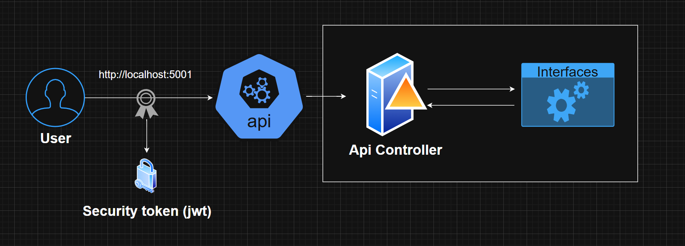

## Stress.Api
This API provides endpoints for stress testing by simulating multiple requests. Use it to evaluate the performance and stability of your system.

## 📄API Reference
### 📝Diagram


### 🔐Authorization in the Api
It implements JWT authentication to secure endpoints, validating issuer, audience, and signature, allowing access only to authorized users.
```
[Authorize(AuthenticationSchemes = "Auth0App1")]
[Authorize(AuthenticationSchemes = "Auth0App2")]
```
Environment variables setting (auth0 in this case)
```
  "Auth0App1": {
    "Issuer": "https://test.asdasdasd.auth0/",
    "Audience": "Test-Api"
  },
  "Auth0App2": {
    "Issuer": "AgusFassina",
    "Audience": "Agusfassina"
  }
```

### 🚀Dotnet build and run
```
dotnet build
dotnet run
```

### 🚀Docker build and run

```
# Docker build
docker build -f Dockerfile -t api .
# Docker run in the port 8787
docker run -d -p 8787:80 -e "ASPNETCORE_ENVIRONMENT=Development" --name api api
# api tests http://localhost:8787/swagger/index.html
```


### 📋Endpoints and detail
1 - Measure CPU usage under high load:
```http
GET /stress/cpu
```
2 - Controlled memory usage:
```http
GET /stress/memory
```

3 - Generate many requests in a short period:
```http
GET /stress/request
```

4 - Measure response latency:
```http
GET /stress/latency
```

5 - Force garbage collection to evaluate memory handling:
```http
GET /stress/gc
```

6 - Spawn multiple threads/tasks to test multithreaded concurrency:
```http
GET /stress/thread
```

7 - Sustained CPU load to test throttling and stability:
```http
GET /stress/cpu-intensity
```

8 - Generate combined load (CPU, memory, requests):
```http
GET /stress/load
```
